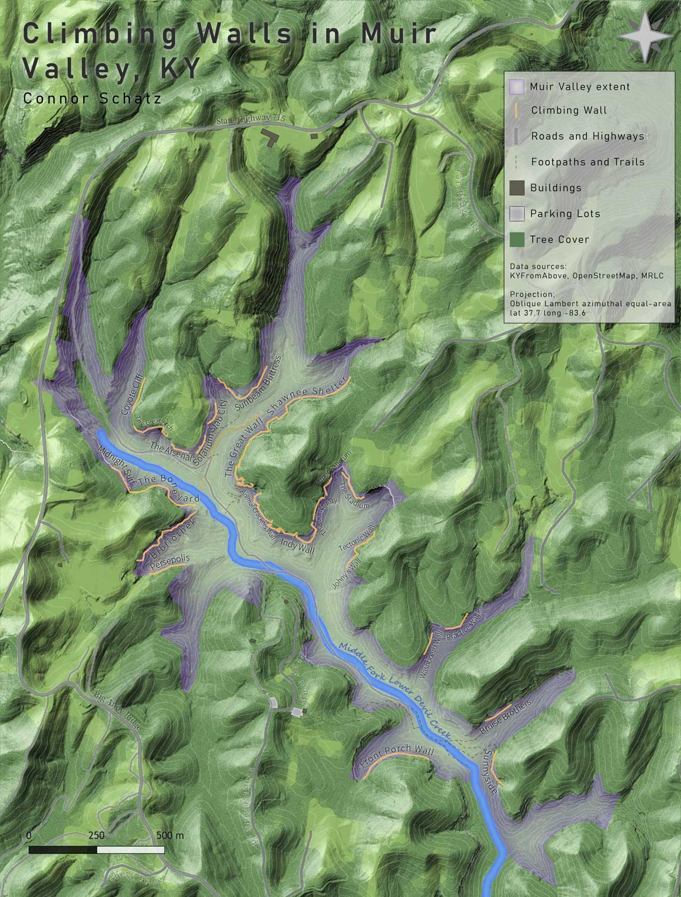

# The Muir Valley

## Introduction

Muir Valley is a privately owned, nonprofit nature reserve and rock climbing destination, south west of Natural Bridge State Park, and features 415 different climbing routes, featuring mainly sport climbs ranging from beginner 5.6s to a very difficult 5.14a according to the Yosimite Decimal System (<a href="https://en.wikipedia.org/wiki/Grade_(climbing)#Free_climbing_2">YDS</a>). This area features many other natural features such as waterfalls, caves and streams which is common for the Red River Gorge area. This project will be looking at the major rock walls in the area, as well as the overall topography of the area.

## Digital Rendering of the Muir Valley Area

A visitor can find the Historic Entrance in streamless valley within quarter-mile walk of the visitor center.

*Map of Muir Valley and its climbing walls*

### Interactive Map of Muir Valley's climbing wall locations

*A map of Muir Valley created using Mapbox Studio [Mapbox link](mapbox/index.html)*

Between these 25 rock walls there are over 400 climbing routes, primarily consisting of sport and trad climbs, drawing in a large number of climbers throughout the year.

### Video fly-through of Muir Valley

This animated point cloud shows the trail that leads to the entrance and cave opening. The camera flies under the pedestrian bridge that connects the Visitor Center with the gift shop. The points are colored by the 2018 color aerial photography. Ground features covered by tree canopy are colored by the top of the canopy.

    
*Fly-through video to the entrance ([Watch video](https://youtu.be/BVVCe_BSsT4))*

## Photographs

     
*Trail around the River Styx*

## Sources and tools

Map was produced by [Tastyfreeze](https://github.com/tastyfreeze) for the University of Kentucky Department of Geography, December 2019. This presentation is part of a final project in GEO 409.

Elevation data was acquired from the Kentucky's Elevation Data & Aerial Photography Program ([KyFromAbove.ky.gov](http://kyfromabove.ky.gov)). Color aerial imagery was acquired from the National Agriculture Imagery Program (NAIP) stored on public FTP server maintained by Kentucky Division of Geographic Information ([DGI](https://technology.ky.gov/gis/Pages/default.aspx))

Various [ArcGIS Pro](https://www.esri.com/en-us/arcgis/products/arcgis-pro/resources) lidar and digital surface model tools were used to process and analyze these data. A Python script was developed to automate this process and is found in this [Jupyter Notebook](build-lidar-analysis.ipynb).
